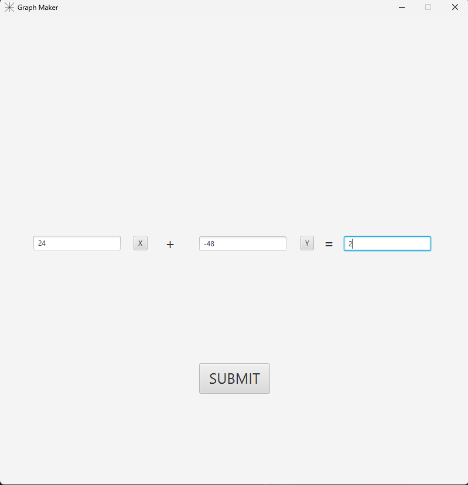
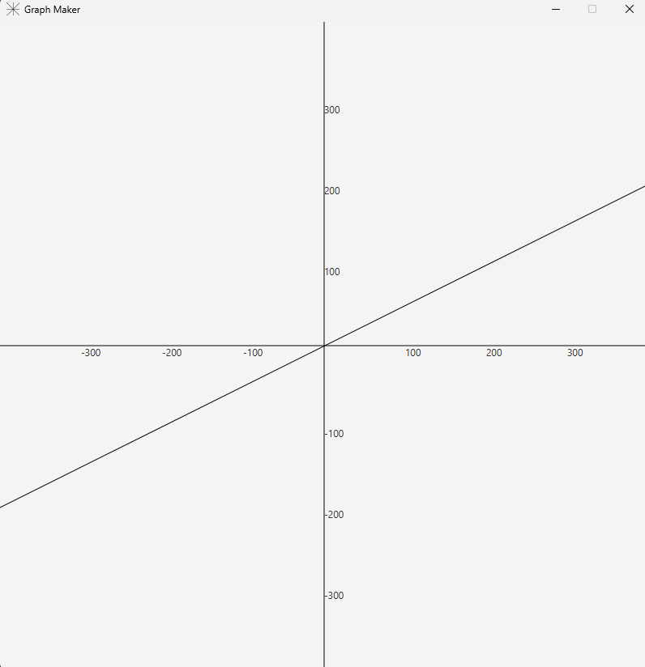

# GraphMaker
A simple JavaFX application to plot graphs from linear equations.

Features:

---Input coefficients for a linear equation.

---Plots the corresponding line on a graph.

How to Run:

(1).Windows (Installer):

--Download GraphMaker_Installer.exe.

--Double-click the installer and follow the prompts to install the application.

--After installation, you can find the program in C:\Program Files\GraphMaker.

--Run GraphMaker.exe to start the application..

(2).Portable version : Unzip and double-click GraphMaker.exe.

(3).FatJAR: requires Java installed, can run by double-clicking.
